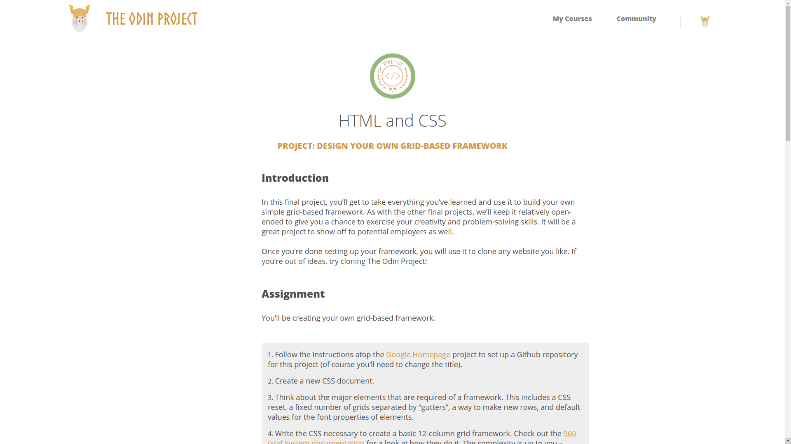

This project aims to build a simple grid framework. The main framework file is in the framework folder. The other files are part of an example page that uses the framework.

Visit this project live at: https://jmart6784.github.io/grid-framework/

OR

Run the project locally:

1. Download or clone the repository.
2. Open index.html with your web browser